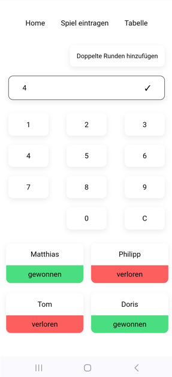
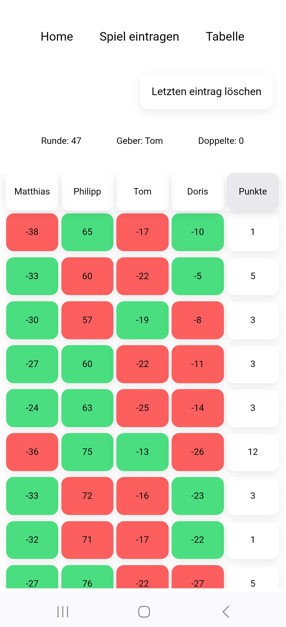
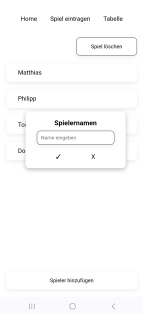

# Tarock Scoring App

> A score-tracking web app for XX rufen and Königrufen — two variants of the Austrian card game Tarock, known for their intricate scoring.

🔗 **Live Demo:** https://philippreischer.github.io/tarock-scoring-app/



| Round entry | Add player |
|---|---|
|  |  |

---

## Features

- **Multi-game management:** create, switch between, and delete separate game sessions, each with its own date and player list
- **Automatic point distribution:** handles all Tarock team compositions (1v1, 1v2, 2v1, 1v3, 3v1, 2v2) and calculates each player's running cumulative total
- **Player management:** add, rename, and remove players per game; late additions are backfilled with zero points for past rounds
- **Double rounds (Doppelte):** configurable accumulated stakes that double all points for the affected round; remaining count tracked per game
- **Color-coded score table:** per-round win/loss coloring, sticky header, auto-scrolls to the latest round
- **Persistent storage:** all game data saved to localStorage automatically — survives page reloads with no user action

## Tech Stack

- **Framework:** Vue 3.5 with Composition API (`<script setup>`)
- **Build Tool:** Vite 7
- **State Management:** Pinia 3 (Options Store) with `pinia-plugin-persistedstate`
- **Storage:** localStorage (via Pinia persistence plugin)
- **Router:** Vue Router 4 with hash history
- **UI:** Custom CSS — no component library
- **Mobile deployment:** Cordova (Android)

## Architecture Highlights

Vite is configured with `base: './'` and builds directly into a sibling Cordova project's `www` folder, allowing the same codebase to ship as both a web app and an Android APK without separate build configurations. Hash-based routing (`createWebHashHistory`) ensures compatibility with Cordova's `file://` protocol, GitHub Pages, and other static hosts without server-side redirects.

All scoring logic lives in a single Pinia action (`calculateGameValue`) that encodes Tarock team compositions as explicit win/lose count comparisons — no formula, just a lookup table. Each player's `points` array stores cumulative totals (not per-round deltas), and a parallel `colorList` array drives win/loss coloring in the table view without any derived state.

## Domain Note

XX rufen and Königrufen are variants of Tarock, a traditional Austrian card game with intricate scoring rules — contracts (Rufer, Solorufer, Solo, Bettler, …), bonus announcements (Pagat ultimo, Trull, …), and multipliers. Manual scorekeeping on paper is error-prone; this app automates the calculation and tracks running totals across rounds.

## Local Setup

```bash
git clone https://github.com/philippreischer/tarock-scoring-app.git
cd tarock-scoring-app
npm install
npm run dev
```

Runs on `http://localhost:5173`

### Build for production

```bash
npm run build
```

Output goes to `../tarock-app/www` — this expects a sibling Cordova project at that relative path. For standalone builds, adjust `outDir` in `vite.config.js`.

### Cordova build

The Vite config builds directly into the Cordova project's `www` folder. After running `npm run build`, use Cordova to package the Android APK:

```bash
cd ../tarock-app
cordova build android
```

### Deploy to GitHub Pages

The live demo is deployed manually: the built output is copied from `../tarock-app/www` to the `gh-pages` branch of this repository.

## Background

Built to replace error-prone paper scorekeeping in my own Tarock round. The main challenge was translating the scoring rules — with all team compositions, contracts, and announcements — into clean code. It was my first fully self-directed project (before it, I'd only built guided exercises during my course), and my first time deploying via Cordova for Android and GitHub Pages for the web demo.

## Status

Stable, in active use by my Tarock group. Mobile APK is built via Cordova from the same codebase.

---

**Author:** Philipp Reischer · [Portfolio](https://philippreischer.github.io)

**License:** All rights reserved. This code is published for portfolio purposes only — no permission is granted for reuse, modification, or redistribution.